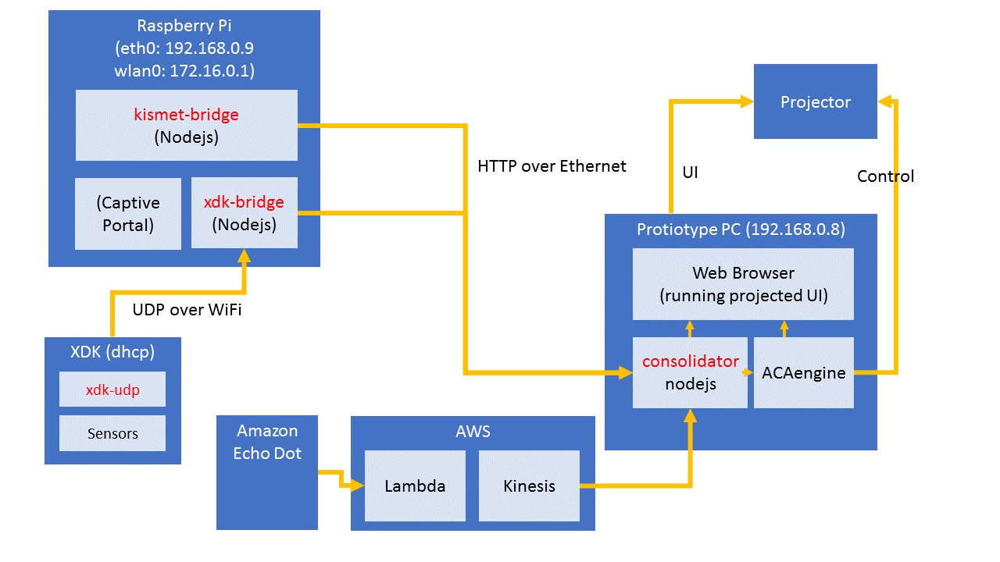

# protiotype
Protiotype development sketches

## System Architecture
The protiotype electronics hardware current consists of the following components:
* Bosch XDK: sensor box, containing temperature, humidity, noise, accelerator, gyro, air pressure and magnetic sensors
* Raspberry Pi: acting as a WiFi access point to collect the data from the XDK and possibly other sensors (could also be Bluetooth LE) and forwards the data to the protiotype PC
* Protiotype PC: backend PC running the database, UI and ACAengine

## Code in Sub-Directories

### romantic lift
A basic sketch switching between different videos depending on how many people are in the lift.

### xdk-udp
XDK firmware which reads all the sensors every 10s (for now), samples noise at 1kHz and broadcasts the data in a UDP packet in the local network to port 6666

### xdk-bridge
Node.js server running on the Raspberry Pi to listen on UDP port 6666 for XDK data, forwarding the same as JSON to the /environment endpoint of the consolidator using a POST request. The JSON is of the following format:

    {"accel":{"x":11,"y":83,"z":1035},"gyro":{"x":12,"y":-40,"z":-132},"lux":5760,"noise":55,"mag":{"x":40,"y":-36,"z":-35},"resistance":6627,"pressure":1011.87,"temperature":32.45,"humidity":55}

The current data in the same format can be read from the same endpoint using the GET method.

### kismet-bridge
Node.js kismet client that pushes the following two pieces of information to the consolidator:

1. List of currently present clients (/clients endpoint)

    {"E0:8E:3C:03:59:FF":{"mac":"E0:8E:3C:03:59:FF","firsttime":1486903784808,"signal":"-78","manufacturer":"AztechEl","lasttime":1486904127299}
    "00:09:0F:F4:2D:50":{"mac":"00:09:0F:F4:2D:50","firsttime":1486904059246,"signal":"-87","manufacturer":"Fortinet","lasttime":1486904115717},
    "E0:8E:3C:17:5B:37":{"mac":"E0:8E:3C:17:5B:37","firsttime":1486904060283,"signal":"-89","manufacturer":"AztechEl","lasttime":1486904100821},
    "3C:B6:B7:D2:8E:69":{"mac":"3C:B6:B7:D2:8E:69","firsttime":1486904062400,"signal":"-88","manufacturer":"VivoMobi","lasttime":1486904134742},
    "40:4D:7F:9F:89:60":{"mac":"40:4D:7F:9F:89:60","firsttime":1486904154939,"signal":"-87","manufacturer":"Apple","lasttime":1486904154939}}

2. Events when a new client appears or disappears (/clients/events endpoint)

    Format TBD

### consolidator
Node.js server which currently collects the data from `xdk-bridge` and `kismet-bridge` and presents the data through the following endpoints

1. `/environment`: data captured by the XDK
2. `/clients`: data from kismet on the Raspberry Pi
3. `/clients/events`: events from kismet indicating the appearence or disappearence of a new client
